<a name="readme-top"></a>

<!-- PROJECT SHIELDS -->

[](https://github.com/Sad-Abd/pyPolyMesher/blob/main/LICENSE)
[-0c674a?style=for-the-badge)](https://sut.ac.ir)
[](https://github.com/Sad-Abd/pyPolyMesher/stargazers)
[](https://doi.org/10.5281/zenodo.12794558)


<!-- PROJECT LOGO -->

<br />
<div align="center">
  <a href="https://github.com/Sad-Abd/pyPolyMehser">
    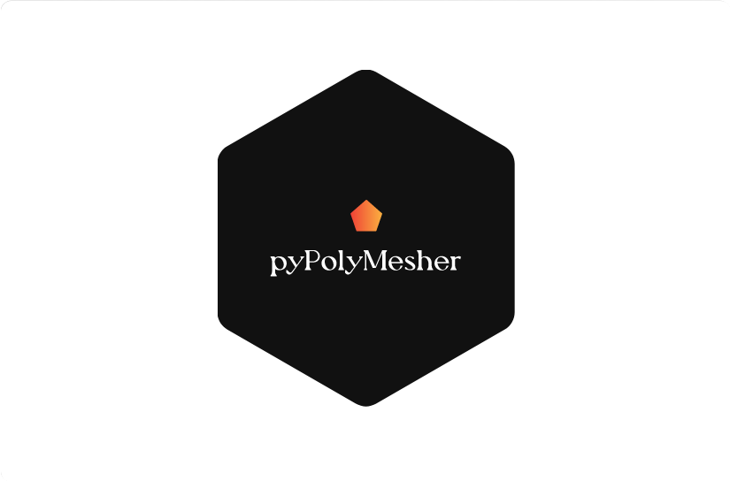
  </a>

<h3 align="center">pyPolyMesher</h3>

  <p align="center">
    Generation of polygonal Mesh
    <br />
    <a href="https://github.com/Sad-Abd/pyPolyMehser"><strong>Explore the docs »</strong></a>
    <br />
    <br />
    <a href="https://github.com/Sad-Abd/pyPolyMehser">View Demo</a>
    ·
    <a href="https://github.com/Sad-Abd/pyPolyMehser/issues">Report Bug</a>
    ·
    <a href="https://github.com/Sad-Abd/pyPolyMehser/issues">Request Feature</a>
  </p>
</div>


<!-- TABLE OF CONTENTS -->
<details>
  <summary>Table of Contents</summary>
  <ol>
    <li><a href="#about-the-project">About The Project</a></li>
    <li>
      <a href="#getting-started">Getting Started</a>
      <ul>
        <li><a href="#installation">Installation</a></li>
      </ul>
    </li>
    <li>
      <a href="#usage">Usage</a>
      <ol>
        <li><a href="#basic-usage">Basic Usage</a></li>
        <li><a href="#internal-sdfs">Internal SDFs</a></li>
        <li><a href="#example-domains">Example Domains</a></li>
        <li><a href="#import-polygon-domain-from-dxf">Import Polygon Domain from DXF</a></li>
        <li><a href="#custom-domain-heart-example">Custom Domain: Heart Example</a></li>
      </ol>
    </li>
    <li><a href="#roadmap">Roadmap</a></li>
    <li><a href="#contributing">Contributing</a></li>
    <li><a href="#license">License</a></li>
    <li><a href="#contact">Contact</a></li>
  </ol>
</details>


<!-- ABOUT THE PROJECT -->
## About The Project

**pyPolyMesher** is a python package for generating unstructured polygonal meshes in arbitrarily defined 2D domains. It allows users to mathematically specify domains using [signed distance functions (SDFs)](https://sadjadabedi.ir/post/demystifying-signed-distance-functions/) and generates high-quality meshes adapted to the geometry and features of the domain. **pyPolyMesher** was initially created as a Python version of the [MATLAB PolyMesher program](http://paulino.princeton.edu/software.html) but has since been enriched with additional features.


Key capabilities:

- Define 2D domains mathematically using signed distance functions
- Built-in library of SDF primitives (circles, rectangles, polygons, etc.) and operations to construct complex domains
- Ability to define custom SDFs for new domain geometries
- Generate unstructured polygonal meshes adapted to domains
- Apply boundary conditions and mark fixed points
- Assess mesh quality metrics like element aspect ratio
- Animate mesh generation process
- Import and mesh polygons from DXF files

By leveraging SDFs to represent domains, pyPolyMesher can capture intricate geometries and generate optimized meshes tailored to them, making it useful for simulations and analysis.

The package provides Lloyd's algorithm for efficient and robust meshing of arbitrary SDF-based domains. Researchers can conveniently translate geometric constructs and concepts into code using the SDF formalism.

Overall, pyPolyMesher simplifies the entire workflow - from domain specification to quality polygonal mesh generation to numerical analysis.


<p align="right">(<a href="#readme-top">back to top</a>)</p>


<!-- GETTING STARTED -->
## Getting Started

This part explains how to install and use this package.

### Installation

You can install this package using pip:
```
pip install PolyMesher
```

Please note that `pyPolyMesher` is published as `PolyMesher` on PYPI.

<p align="right">(<a href="#readme-top">back to top</a>)</p>

<!-- USAGE EXAMPLES -->
## Usage

### Basic Usage:

`pyPolyMesher.PolyMesherPolyMesher(Domain, NElem, MaxIter, P=None, anim=False)`: Generate polygon mesh on `Domain` with `NElem` number of elements. Improve mesh for `MaxIter` iterations. Can be given an initial point set `P`. 

```python
import pyPolyMesher
from pyPolyMesher.exampleDomains import MichellDomain
MichellDomain.Plot()
Node, Element, Supp, Load, P = pyPolyMesher.PolyMesher(MichellDomain, 50, 100)
```

### Internal SDFs:
```python
from pyPolyMesher import dFunctions as DF
```
1. `DF.dLine(P, x1, y1, x2, y2)`: Calculate the signed distance from points P to a line segment defined by two endpoints (x1, y1) and (x2, y2).
2. `DF.dCircle(P, xc, yc, r)`: Calculate the signed distance from points P to a circle defined by its center (xc, yc) and radius (r).
3. `DF.dRectangle(P, x1, x2, y1, y2)`: Calculate the signed distance from points P to a rectangle defined by its bottom-left (x1, y1) and top-right (x2, y2) coordinates.
4. `DF.dPolygon(P, vertices)`: Calculate the signed distance from points P to a polygon defined by its vertices.
5. `DF.dUnion(d1, d2)`: Calculate the signed distance field resulting from the union of two distance fields (d1 and d2).
6. `DF.dIntersect(d1, d2)`: Calculate the signed distance field resulting from the intersection of two distance fields (d1 and d2).
7. `DF.dDiff(d1, d2)`: Calculate the signed distance field resulting from the difference of two distance fields (d1 and d2).

### Example Domains:
<details>
  <summary>Example Domains</summary>

1. [`pyPolyMesher.exampleDomains.MbbDomain`](src/pyPolyMesher/exampleDomains.py#L164)

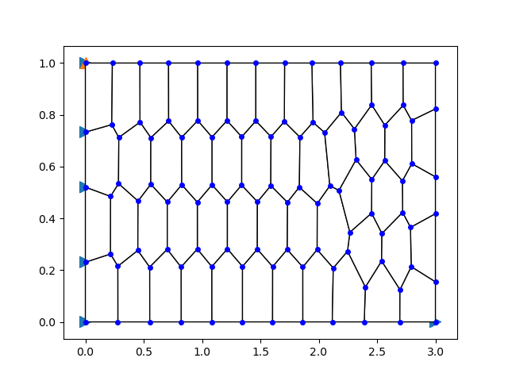

2. [`pyPolyMesher.exampleDomains.HornDomain`](src/pyPolyMesher/exampleDomains.py#L132)

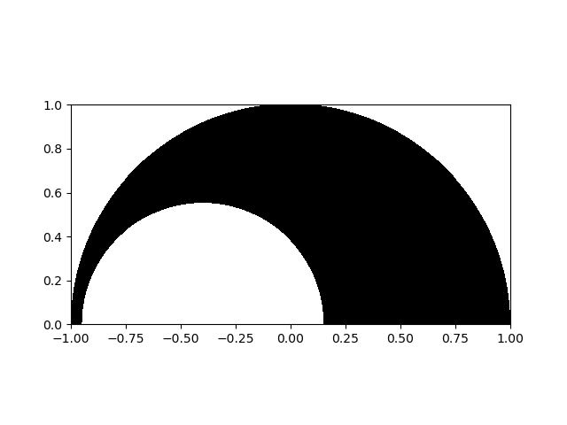

3. [`pyPolyMesher.exampleDomains.WrenchDomain`](src/pyPolyMesher/exampleDomains.py#L123)

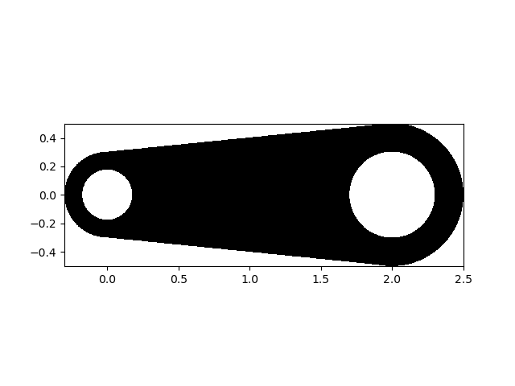

4. [`pyPolyMesher.exampleDomains.MichellDomain`](src/pyPolyMesher/exampleDomains.py#L91)

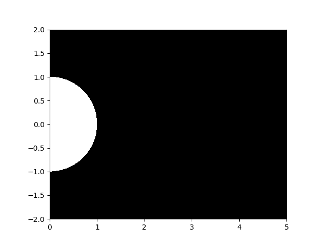

5. [`pyPolyMesher.exampleDomains.SuspensionDomain`](src/pyPolyMesher/exampleDomains.py#L68)

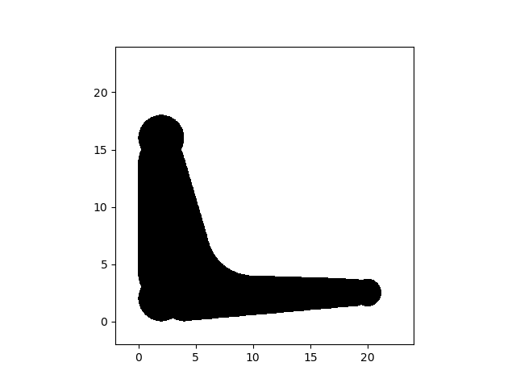

6. [`pyPolyMesher.exampleDomains.CookDomain`](src/pyPolyMesher/exampleDomains.py#L26)

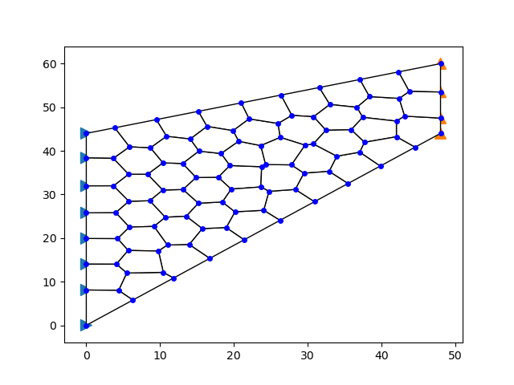

</details>


### Import Polygon Domain from DXF:

```python
from pyPolyMesher import PolyMesher, Domain, mesh_assessment
from pyPolyMesher.dxfImporter import dxf_polygon
from pyPolyMesher.dFunctions import dPolygon

dxf_file_path = 'examples/polygon1.dxf'
v = dxf_polygon(dxf_file_path)

SDF = lambda P: dPolygon(P, v)
dxfDomain = Domain("DXF Polygon Domain", [0,100,0,100], SDF)
dxfDomain.Plot()
```

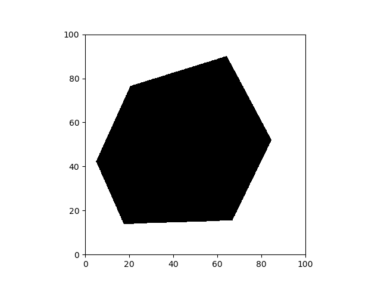

```python
Node, Element, Supp, Load, P = PolyMesher(dxfDomain, 50, 100)

area = dxfDomain.CalculateArea()
metrics = mesh_assessment(Node, Element, area, verbose = True)
```
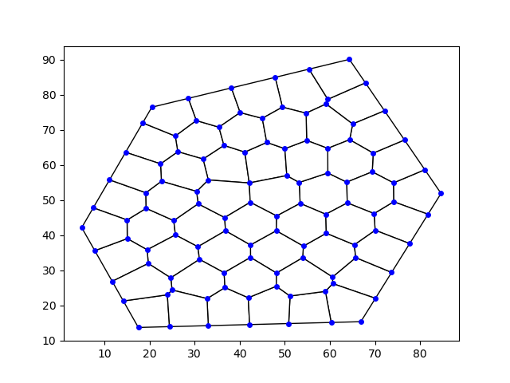

It should be noted that the `CalculateArea` method calculates the approximate area of the domain using the Monte Carlo method. 

The `mesh_assessment` function calculates the following mesh quality metrics:
-  Maximum aspect ratio (AR)
-  Average AR
-  Average edge length across all elements
-  Range of element areas (minimum and maximum)
-  Standard deviation of element areas
-  Total area error between domain area and total element areas (obviously in case the domain area is provided)

### Custom Domain: Heart Example

The custom domain build from the SDF definition of heart geometry is available at [heart_example.py](examples/heart_example.py).

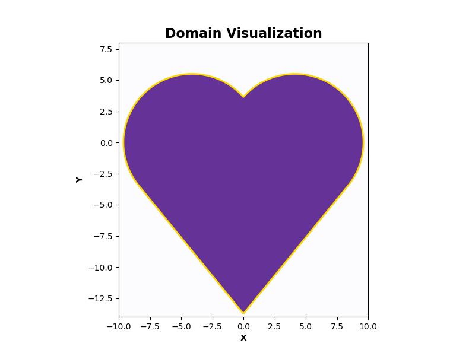
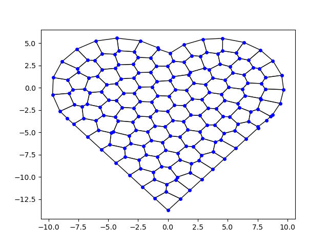

See [Examples.py](examples/Examples.py) and [Example Notebook](examples/Examples.ipynb) for more examples.

<p align="right">(<a href="#readme-top">back to top</a>)</p>

<!-- ROADMAP -->
## Roadmap

### Section 1 - Current Focus and Issue Resolution

1. Define `Domain` from `dxf` files
    * ~~Polygon importer~~
    * Circle importer
    * Spline importer
    * Automatic SDF for geometries
2. Add mesh quality assessments
    * ~~Aspect Ratio~~
    * ~~Standard Deviation of Elements Areas~~

### Section 2 - Upcoming Priorities
1. Enhance the **README** with more detailed information.
2. Publish the package on *PYPI* and *Zenodo* for wider distribution.
3. Add some tests.

### Section 3 - Vision and Future Prospects

1. Develop a GUI for domain definition to improve user interaction.
2. Plugin for CAD programs.
3. Explore and brainstorm alternative options for domain definition and future possible expansions.

See the [open issues](https://github.com/Sad-Abd/pyPolyMesher/issues) for a full list of proposed features (and known issues).

<p align="right">(<a href="#readme-top">back to top</a>)</p>

<!-- CONTRIBUTING -->
## Contributing

Contributions are what make the open source community such an amazing place to learn, inspire, and create. Any contributions you make are **greatly appreciated**.

If you have a suggestion that would make this better, please fork the repo and create a pull request. You can also simply open an issue with the tag "enhancement".
We appreciate your interest in pyPolyMesher!. Don't forget to give the project a star! Thanks again!


<p align="right">(<a href="#readme-top">back to top</a>)</p>

<!-- LICENSE -->
## License

This project is licensed under the GPLv3 License - see the LICENSE file for details.
Contact

<p align="right">(<a href="#readme-top">back to top</a>)</p>

## Contact

If you have any questions or feedback, feel free to reach out:

Email: AbediSadjad@gmail.com

GitHub: [Sad-Abd](https://github.com/Sad-Abd)
